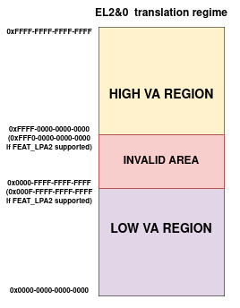

.. SPDX-License-Identifier: BSD-3-Clause
.. SPDX-FileCopyrightText: Copyright TF-RMM Contributors.

MMU setup and memory management design in RMM
=============================================

This document describes how the MMU is setup and how memory is managed
by the |RMM| implementation.

Physical Address Space
----------------------

The Realm Management Extension (``FEAT_RME``) defines four Physical Address
Spaces (PAS):

-  Non-secure
-  Secure
-  Realm
-  Root

|RMM| code and |RMM| data are in Realm PAS memory, loaded and allocated to
Realm PAS at boot time by the EL3 Firware. This is a static carveout and it
is never changed during the lifetime of the system.

The size of the |RMM| data is fixed at build time. The majority of this is the
granule array (see `Granule state tracking`_ below), whose size is configurable
and proportional to the maximum amount of delegable DRAM supported by the
system.

Realm data and metadata are in Realm PAS memory, which is delegated to the
Realm PAS by the Host at runtime. The |RMM| ABI ensures that this memory cannot
be returned to Non-secure PAS ("undelegated") while it is in use by the
|RMM| or by a Realm.

NS data is in Non-secure PAS memory. The Host is able to change the PAS
of this memory while it is being accessed by the |RMM|. Consequently, the
|RMM| must be able to handle a Granule Protection Fault (GPF) while accessing
NS data as part of RMI handling.

.. _granule state tracking:

Granule state tracking
----------------------

The |RMM| manages a data structure called the `granules` array, which is
stored in |RMM| data memory.

The `granules` array contains one entry for every Granule of physical
memory which was in Non-secure PAS at |RMM| boot and can be delegated.

Each entry in the `granules` array contains a field `granule_state` which
records the *state* of the Granule and which can be one of the states as
listed below:

-  NS: Not Realm PAS (i.e. Non-secure PAS, Root PAS or Secure PAS)
-  Delegated: Realm PAS, but not yet assigned a purpose as either Realm
   data or Realm metadata
-  RD: Realm Descriptor
-  REC: Realm Execution Context
-  REC aux: Auxiliary storage for REC
-  Data: Realm data
-  RTT: Realm Stage 2 translation tables

As part of RMI SMC handling, the state of the granule can be a pre-condition
and undergo transtion to a new state. For more details on the various granule
states and their transtions, please refer to the RMM specification.

For further details, see:

-  ``enum granule_state``
-  ``struct granule``

.. _RMM stage 1 translation regime:

RMM stage 1 translation regime
------------------------------

|RMM| uses the ``FEAT_VHE`` extension to split the 64-bit VA space into two
address spaces as shown in the figure below:

|full va space|

-  The Low VA range: it expands from VA 0x0 up to the maximum VA size
   configured for the region (with a maximum VA size of 48 bits or 52 bits
   if ``FEAT_LPA2`` is supported). This is used to map the |RMM| Runtime
   (code and data) using the `Stage 1 Low VA range`_
-  The High VA range: It expands from VA 0xFFFF_FFFF_FFFF_FFFF all the way down
   for a length equal to the maximum VA size configured for the region.
   This region is used by the `Stage 1 High VA - Slot Buffer mechanism`_
   as well as the `Per-CPU stack mappings`_.

There is a range of invalid address space between both ranges that cannot be
mapped to any of them.

The 2 VA ranges are used for 2 different purposes in RMM as described below.

Stage 1 Low VA range
--------------------

The Low VA range is used to create static mappings which are shared accross all
the CPUs. It encompases the RMM executable binary memory and the EL3 Shared
memory region.

The RMM Executable binary memory consists of code, RO data and RW data. Note
that the stage 1 translation tables for the Low Region are kept in RO data, so
that once the MMU is enabled, the tables mappings are protected from further
modification.

The EL3 shared memory, which is allocated by the EL3 Firmware, is used by the
`RMM-EL3 communications interface`_. A pointer to the beginning of this area
is received by |RMM| during initialization. |RMM| will then map the region in
the .rw area.

The Low VA range is setup by the platform layer as part of platform
initilaization.

The diagram below shows the memory layout for the Low VA region.

|low va region|

Stage 1 High VA range
---------------------

The High VA range is used to create dynamic per-CPU mappings. The tables used
for this are private to each CPU and hence it is possible for every CPU to map
a different PA at a specific VA. This property is used by the `slot-buffer`
mechanism as described later.

In order to allow the mappings for this region to be dynamic, its translation
tables are stored in the RW section of |RMM|, allowing for it to be
modified if needed.

The RMM makes use of the high VA region for the `slot-buffer` mechanism and
for the per-CPU Stacks.

For more details see ``xlat_high_va.c`` file of the xlat library.

The diagram below shows the memory layout for the High VA region.

|upper range memory|

Stage 1 High VA - Slot Buffer mechanism
~~~~~~~~~~~~~~~~~~~~~~~~~~~~~~~~~~~~~~~

The |RMM| provides a dynamic mapping mechanism called `slot-buffer` in the
high VA region. This assigned VA space for `slot-buffer` is divided into
`slots` of size equal to ``GRANULE_SIZE``.

The |RMM| has a fixed number of `slots` per CPU. Each `slot` is used to map
memory of a particular category. The |RMM| validates that the target physical
granule is of the expected `granule_state` by looking up the corresponding
entry in `granules` array.

This design avoids the need for generic allocation of VA space. The
rationalization of all mappings ever needed for managing a realm via `slots`
is only possible due to the simple nature of the |RMM| design - in particular,
the fact that it is possible to statically determine the types of objects
which need to be mapped into the |RMM|'s address space, and the maximum
number of objects of a given type which need to be mapped at any point
in time.

The `slot-buffer` mechanism has `slots` for mapping memory of the following
types:

   -  Realm metadata: These correspond to the specific Realm and Realm
      Execution context scheduled on the PE. These mappings are usually only
      valid during the execution of an RMI or RSI handlers and are removed
      afterwards. These include Realm Descriptors (RDs), Realm Execution
      Contexts (RECs), Realm Translation Tables (RTTs).

   -  NS data: RMM needs to map NS memory as part of RMIs to access parameters
      passed by the Host or to return arguments to the Host. RMM also needs
      to copy Data provided by the Host as part of populating the Realm
      data memory.

   -  Realm data: RMM sometimes needs to temporarily map Realm data memory
      during Realm creation in order to load the Realm image or access buffers
      specified by the Realm as part of RSI commends.

For more details on the `slots`, refer to ``enum buffer_slot``

During Realm entry and Realm exit, the RD is mapped in the "RD" buffer
slot. Once Realm entry or Realm exit is complete, this mapping is
removed. The RD is not mapped during Realm execution.

The REC and the *RmiRecRun* data structures are both mapped during Realm
execution.

As the *slot buffers* are mapped on the High VA region, each CPU in the
system has its own translation context for such mappings, which means that
a particular slot buffer descriptor will always be mapped to the same VA,
regardless of the CPU or if other CPUs have the same slot buffer descriptor
in use. This also allows the migration of vCPUs accross different CPUs if
an operation is interrupted, for instance while the Realm attestation is
ongoing in RMM. The slot buffer implementation includes some optimizations,
such as internal caches for the translation table entries, which allows to
improve the efficiency of mapping and unmapping operations.

As an alternative to using dynamic buffer slots, the approach of
maintaining static mappings for all physical memory (similar to the
linear map in the Linux kernel) was considered, but rejected on the
grounds that this could permit arbitrary memory access for an attacker
who is able to subvert |RMM| execution.

The xlat lib APIs are used by the `slot-buffer` to create dynamic mappings.
These dynamic mappings are stored in the high VA region's ``xlat_ctx``
structure and marked by the xlat library as *TRANSIENT*. This helps xlat lib to
distinguish valid Translation Table Entries from invalid ones as otherwise the
unmapped dynamic TTEs would be identical to INVALID ones.

For further details, see:

-  ``enum buffer_slot``
-  ``lib/realm/src/buffer.c``

Per-CPU stack mappings
~~~~~~~~~~~~~~~~~~~~~~

Each CPU uses its on stack, which is mapped into the High VA region starting
at the same VA for all the CPUs. At boot time, each CPU calculates the PA for
the beginning of its stack and maps it to the corresponding VA of its address
space.

The per-CPU stack mapping allows a 1 page gap at the end of the maximum space
allocated for the stack. This will cause a memory fault in the case of a stack
overflow, so the |RMM| can perform any mitigation for it, such as to notify the
EL3-Firmware and disable the Realm world.

The rest of the VA space available below the stack is unused and therefore left
unmapped.

Stage 1 translation library (xlat library)
------------------------------------------

The |RMM| stage 1 translation regime is taken care of by the xlat library.
This library is able to support up to 52-bit addresses and 5 levels of
translation (when ``FEAT_LPA2`` is enabled).

The xlat library is designed to be stateless and it uses the abstraction of
`translation context`, modelled through the ``struct xlat_ctx``. A translation
context stores all the information related to a given VA space, such as the
translation tables, the VA description used to initialize the context and any
internal status related to such VA. Once a context has been initialized, its
VA space cannot be modified.

At the moment, although the xlat library supports creation of multiple
contexts, it assumes that the caller will only use a single context per
CPU of a given VA region. The library does not offer support to switch
contexts on a CPU at run time. A context can be shared by several CPUs
in the same VA region to share the mappings like, for instance, the low
VA region.

Dynamic mappings can be created by the specific ``TRANSIENT`` flag. The
high VA region create dynamic mappings using this flag.

For further details, see ``lib/xlat``.

RMM executable bootstrap
------------------------

The |RMM| is loaded as binary with various sections. The size of the sections
in the |RMM| binary as well as the placing of |RMM| code and data into
appropriate sections is controlled by the linker script.

Platform initialization code takes care of importing the linker symbols
that define the boundaries of the different sections and creates static
memory mappings that are then used to initialize an ``xlat_ctx`` structure
for the low VA region. The sections are flat-mapped and are shared accross all
the CPUs on the system. All the translation tables used on this context will
be stored in a read-only section, hardening the overall security of the sytem.
In addition, as |RMM| is compiled as a Position Independed Executable (PIE)
at address 0x0, the Global Offset Table (GOT) and other relocations in the
binary are fixed up with the right offsets as part of boot. This allows RMM
to be run at any physical address as a PIE regardless of the compile time
address.

For further details, see:

-  ``runtime/linker.lds``
-  ``plat/common/src/plat_common_init.c``
-  ``plat/fvp/src/fvp_setup.c``

Glossary
--------

-  GPF: Granule Protection Fault
-  IPA: Intermediate Physical Address
-  PA: Physical Address
-  PAR: Protected Address Range
-  PAS: Physical Address Space
-  RMM: Realm Management Monitor
-  RTT: Realm Translation Table
-  VHE: Virtualization Host Extensions

References
----------

.. |upper range memory| image:: ./diagrams/upper_memory_diagram.png
   :height: 600
.. _`RMM-EL3 communications interface`: https://trustedfirmware-a.readthedocs.io/en/latest/components/rmm-el3-comms-spec.html
