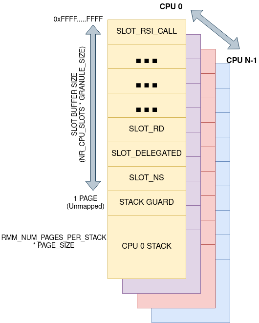

.. SPDX-License-Identifier: BSD-3-Clause
.. SPDX-FileCopyrightText: Copyright TF-RMM Contributors.

Memory management
=================

This document describes how memory used by the |RMM| is managed by the
|RMM| implementation as well as it introduces some details on the Stage 1
MMU setup in RMM.

Categories of memory for the Stage 1 mappings
---------------------------------------------

Memory accessed and managed by the |RMM| is divided into two different regions
depending on the VA as well as other properties. These regions are:

- Low region. This is the VA space spawning from the address 0x0 all the
  way up to address 0x0000_FFFF_FFFF_FFFF (or 0x000F_FFFF_FFFF_FFFF if
  ``FEAT_LPA2`` is enabled) and it corresponds to the ``User Space`` Region
  as defined by the Aarch64 architecture. The mappings on this region are
  shared accross all the CPUs and it emcompases the following:

   -  |RMM| code

   -  |RMM| RO

      - This region also stores the translation tables for the Low Region, so
        once the MMU is enabled the mappings are protected and cannot be
	modified.

   -  |RMM| RW data

      -  Granule state tracking (see `Granule state tracking`_)
      -  |RMM| stage 1 translation tables (see `RMM stage 1 translation
         regime`_)

   -  Shared page for EL3-RMM communications

- High Region. This is the VA space spawning from the address
  0xFFFF_0000_0000_0000 (or 0xFFF0_0000_0000_0000 if ``FEAT_LPA2`` is enabled)
  all the way up to address 0xFFFF_FFFF_FFFF_FFFF and it correspons to the
  ``Kernel Space`` Region as defined by the Aarch64 architecture. In order to
  map an address to this area, it needs to comply with the following mandatory
  properties:

   -  The mappings are per-CPU. Each CPU maintains its own xlat context with
      its own set of translation tables, so the same VA can be mapped to
      different PA on different CPUs.

  Additionally, the following optional properties are reserved to addresses on
  the High Region:

   -  The mapping can be dynamic, in the sense that it can change during the
      life of the system (e.g. a ``TRANSIENT MAPPING``).

  In order to allow the mappings for this region to be dynamic, its xlat tables
  are stored into the ``RW`` section of |RMM|, allowing for RMM to modify the
  mappings if needed.

  The High Region maps the following areas:

   -  Realm metadata correspondig to the specific Realm and Realm Execution
      context scheduled on the PE. These mappings are usually only valid during
      the execution of an RMI or RSI handlers and are removed afterwards

      -  Realm Descriptors (RDs)
      -  Realm Execution Contexts (RECs)
      -  Realm Translation Tables (RTTs)

   -  NS data

      -  Parameters passed by the Host to |RMM| commands, which are too large
         to be passed via GPRs
      -  Data provided by the Host, for copying by the |RMM| into Realm data
         memory
      -  The *RmiRecRun* data structure, used to communicate between the Host
         and the |RMM| on Realm entry and on Realm exit
      -  Non-secure memory which is mapped into the IPA space of a Realm,
         outside the PAR

   -  Realm data

      -  Memory that can be used for code and data by the Realm and which
         is mapped into the IPA space of a Realm via RTTs inside the Protected
         Address Range (PAR). Some of this memory might need to be temporarly
	 mapped by RMM during Realm creation in order to load the Realm image.

   - Per-CPU Stacks.

The following sections describe how the physical memory in each of these
categories is provided to the |RMM|, and how the |RMM| manages translation
table mappings to this memory.

Physical Address Space
----------------------

The Realm Management Extension (RME) defines four Physical Address
Spaces (PAS):

-  Non-secure
-  Secure
-  Realm
-  Root

|RMM| code and |RMM| data are in Realm PAS memory, loaded and allocated to at
Realm PAS at boot by the EL3 Firware. This is a static allocation, so this
memory is never accessible to the Host.

The size of the |RMM| data is fixed at build time. The majority of this is the
granule array (see `Granule state tracking`_ below), whose size is configurable
and proportional to the maximum amount of delegable DRAM supported by the
system.

Realm data and metadata are in Realm PAS memory, which is delegated to the
Realm PAS by the Host at runtime. The |RMM| ABI ensures that this memory cannot
be returned to Non-secure PAS ("undelegated") while it is in use by the
|RMM| or by a Realm.

NS data is in Non-secure PAS memory. The Host is able to change the PAS
of this memory while it is being accessed by the |RMM|. Consequently, the
|RMM| must be able to handle a Granule Protection Fault (GPF) while accessing
NS data.

.. _granule state tracking:

Granule state tracking
----------------------

The |RMM| manages a data structure called the granule array, which is
stored in |RMM| data memory.

The granule array contains one entry for every Granule of physical
memory which was in Non-secure PAS at |RMM| boot and can be delegated.

Each entry in the granule array contains a field which records the
*state* of the Granule:

-  NS: Not Realm PAS (i.e. Non-secure PAS, Root PAS or Secure PAS)
-  Delegated: Realm PAS, but not yet assigned a purpose as either Realm
   data or Realm metadata
-  RD: Realm Descriptor
-  REC: Realm Execution Context
-  REC aux
-  Data: Realm data
-  RTT

For further details, see:

-  ``enum granule_state``
-  ``struct granule``

.. _RMM stage 1 translation regime:

RMM stage 1 translation regime
------------------------------

Stage 1 translation library (xlat library)
~~~~~~~~~~~~~~~~~~~~~~~~~~~~~~~~~~~~~~~~~~

The |RMM| stage 1 translation regime is taken care of by the xlat library. This
library, which is able to support up to 52-bit addresses and 5 levels of
translation (when ``FEAT_LPA2`` is enabled) is configured by |RMM| to use

-  Up to 38 bits of VA space (256G) per address region (modifiable through
   ``VIRT_ADDR_SPACE_WIDTH`` build option)
-  3 levels of translation tables (L1 to L3)

In order to keep the bootstrap of Stage 2 MMU simple, VHE is used by the xlat
library to split the 64-bit VA space into two address spaces:

-  The Low VA range: it expands from VA 0x0 up to the maximum VA size
   configured for the region (with a maximum VA size of 48 bits or 52 bits
   if ``FEAT_LPA2`` is supported). This is used to map the |RMM| Runtime
   (code and data) using the `Low VA mappings`_
-  The High VA range: It expands from VA 0xFFFF_FFFF_FFFF_FFFF all the way down
   for a length equal to the maximum VA size configured for the region.
   This region is used by the `Slot Buffer mappings`_ as well as the 
   `Per-CPU stack mappings`_.

The xlat library is designed to be stateless and it uses the abstraction of
`translation context`, modelled through the ``struct xlat_ctx``. A translation
context stores all the information related to a given VA space, such as the
translation tables, the VA description used to initialize the context and any
internal status related to such VA. Once a context has been initialized, its
VA space cannot be modified.

At the moment, the xlat library supports only a single context per CPU and
per VA region. This context can be shared by several CPUs in the same VA
region if needed, for instance, because they all share the same mappings.

For further details, see ``lib/xlat``.

Low VA mappings
~~~~~~~~~~~~~~~

The |RMM| is loaded as an ELF binary with various sections. The loader of
the |RMM| allocates memory for each section available in the |RMM| binary.

The size of the sections in the |RMM| binary as well as the placing of
|RMM| code and data into appropriate sections is controlled by the linker
script.

Platform initialization code takes care of importing the linker symbols
that define the boundaries of the different sections and creates static
memory mapping representations that are then used to initialize an ``xlat_ctx``
structure for the low VA region. The context will generate flat mappings
and these will be shared accross all the CPUs on the system. All the
translation tables used on this context will be stored in a read-only section,
hardening the overall security of the sytem.
In addition, as |RMM| is compiled as a Position Independed Execution (PIE)
application at offset 0x0, the Global Offset Table (GOT) and other relocations
are fixed up with the right offsets as part of boot. This allows to be run at
any physical address as a PIE.

The diagram below, corresponding to the full VA space of the system, shows the
memory layout for the Low VA region.

|full va space|

For further details, see:

-  ``runtime/linker.lds``
-  ``plat/common/src/plat_common_init.c``
-  ``plat/fvp/src/fvp_setup.c``

Slot Buffer mappings
~~~~~~~~~~~~~~~~~~~~

The |RMM| maps a dynamic memory area in the High VA region. This area is
divided in slots of size equal to ``GRANULE_SIZE``. These slots are
referred by |RMM| as *slot buffers*

The |RMM| has a fixed number of *slot buffer* per CPU. These are used to
create dynamic mappings of buffers used by the |RMM|. These dynamic mappings
are stored in a ``xlat_ctx`` for the high VA region and marked by the xlat
library as *TRANSIENT*, to distinguish their Translation Table Entries from
invalid ones, as they can be temporarly invalid but eventually will be used
to map a buffer.

Each buffer slot is used to map memory of a particular category. The |RMM|
validates that the target physical granule is of the expected category
using the tag value in the tag-lock for that granule.

This avoids the need for generic allocation of VA space. This is only
possible due to the simple nature of the |RMM| design - in particular, the
fact that it is possible to statically determine the types of objects
which need to be mapped into the |RMM|'s address space, and the maximum
number of objects of a given type which need to be mapped at any point
in time.

Buffer slots include:

-  ``SLOT_NS``: used to access NS data during execution of RMI handlers
-  ``SLOT_DELEGATED``: used to access a granule in Delegated state
-  A slot for each type of Realm metadata granule

During Realm entry and Realm exit, the RD is mapped in the "RD" buffer
slot. Once Realm entry or Realm exit is complete, this mapping is
removed. The RD is not mapped during Realm execution.

The REC and the *RmiRecRun* data structures are both mapped during Realm
execution.

The *slot buffers* are mapped in the upper address range. The VA space used
by these buffers is fixed at build time and it depends on the the number of
*slot buffer* descriptors defined in ``enum granule_state``.

As the *slot buffers* are mapped on the High VA region, each CPU in the
system has its own translation context for such mappings, which means that
a particular slot buffer descriptor will always be mapped to the same VA,
regardless of the CPU or if other CPUs have the same slot buffer descriptor
in use. The slot buffer implementation includes some optimizations,
such as internal caches for the translation table entries, which allows to
improve the efficiency of mapping and unmapping operations. This also allows
the migration of vCPUs accross different CPUs if an operation is interrupted,
for instance while the Realm attestation is ongoing in RMM.

As an alternative to using dynamic buffer slots, the approach of
maintaining static mappings for all physical memory (similar to the
linear map in the Linux kernel) was considered, but rejected on the
grounds that this could permit arbitrary memory access for an attacker
who is able to subvert |RMM| execution.

Per-CPU stack mappings
~~~~~~~~~~~~~~~~~~~~~~

Each CPU uses its on stack, which is mapped into the High VA region starting
at the same VA for all the CPUs. At boot time, each CPU calculates the PA for
the top of its stack and maps it to the corresponding VA of its address space.

The per-CPU stack mapping allows a 1 page gap at the end of the maximum space
allocated for the stack. This will cause a memory fault in the case of a stack
overflow, so the |RMM| can perform any mitigation for it, such as notify the
EL3-Firmware and disable the Realm world.

The rest of the VA space allocated below the stack is unused and therefore left
unmapped.

The diagram below shows the memory layout for the High VA region.

|upper range memory|

For further details, see:

-  ``enum buffer_slot``
-  ``lib/realm/src/buffer.c``
-  ``struct granule``
-  ``xlat_high_va.c``

.. _Realm stage 2 translation regime:

Glossary
--------

-  GPF: Granule Protection Fault
-  IPA: Intermediate Physical Address
-  PA: Physical Address
-  PAR: Protected Address Range
-  PAS: Physical Address Space
-  RMM: Realm Management Monitor
-  RTT: Realm Translation Table
-  VHE: Virtualization Host Extensions

References
----------

.. |full va space| image:: ./diagrams/full_va_space_diagram.png
   :height: 600

