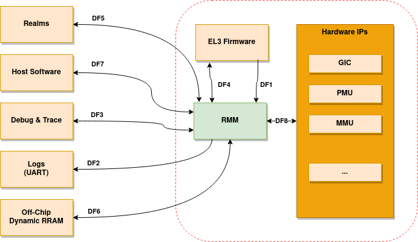

.. SPDX-License-Identifier: BSD-3-Clause
.. SPDX-FileCopyrightText: Copyright TF-RMM Contributors.

Data Flow Diagram
=================

This section describes the Data Flow Diagram for RMM.

********************
Target of Evaluation
********************

In this threat model, the target of evaluation is the Realm Manager Monitor
(RMM) for an Arm A-Class CPU with Realm Management Extension, as shown on
Figure 1. Everything else on Figure 1 is outside of the scope of the evaluation.

RMM can be configured in various ways. In this threat model we consider
only the most basic configuration. To that end we make the following
assumptions:

- RMM image is run from either ROM, on-chip trusted SRAM or off-chip DRAM.
  Any memory shared with EL3 Firmware is located inside on-chip trusted SRAM.
  If RMM runs out of off-chip DRAM, then RMM is vulnerable to DRAM attacks
  (such as rowhammer) and attacks which can probe and tamper off-chip memory.

- No experimental features are enabled. We do not consider threats that may come
  from them.

- RME hardware threats and threats covered by the RMM ABI will be covered in a
  dedicated Security Risk Analysis document (to be published in the future).
  Although there is some overlap with threats mitigated by RME hardware and RMM
  ABI, this threat model focuses on covering threats specific to the RMM
  implementation and associated data flows.

*****************
Data Flow Diagram
*****************

Figure 1 shows a high-level data flow diagram for RMM. The diagram
shows a model of the different components of a RMM system and
their interactions with other FW/SW components. A description of each
diagram element is given in Table 1. In the diagram, the red broken lines
indicate trust boundaries. Components outside of the broken lines
are considered untrusted by RMM.

|DFD Diagram|

.. table:: Table 1: RMM Data Flow Diagram Description

  +-----------------+--------------------------------------------------------+
  | Diagram Element | Description                                            |
  +=================+========================================================+
  |       DF1       | | At boot time, EL3 Firmware configures RMM through    |
  |                 |   paramaters stored in registers x0 to x3. It also     |
  |                 | | passes a Boot Manifest using secure shared memory.   |
  |                 |   The first CPU executes the cold-boot path, whereas   |
  |                 | | the rest of CPUs execute the warm-boot path.         |
  |                 |   Both cold and warm boots receive parameters from     |
  |                 | | EL3 Firmware, including a Boot Manifest.             |
  +-----------------+--------------------------------------------------------+
  |       DF2       | | RMM log system framework outputs debug messages      |
  |                 |   over a UART interface.                               |
  +-----------------+--------------------------------------------------------+
  |       DF3       | | Debug and trace IP on a platform can allow access    |
  |                 |   to registers and memory of RMM.                      |
  +-----------------+--------------------------------------------------------+
  |       DF4       | | Interface for RMM-EL3 communication as per documented|
  |                 |   in `RMM-EL3 Runtime Interface`_. RMM trusts EL3,     |
  |                 | | which is part of a trusted subsystem. Therefore, this|
  |                 |   is out of scope of the Threat Model for RMM.         |
  +-----------------+--------------------------------------------------------+
  |       DF5       | | Realm software can interact with RMM to request      |
  |                 |   services through the RSI (Ream Service Interface).   |
  |                 | | This also includes the PSCI interface.               |
  +-----------------+--------------------------------------------------------+
  |       DF6       | | Realm software can run either from ROM, RAM or secure|
  |                 |   memory, but regardless of it, it will always need to |
  |                 | | use off-chip dynamic RAM (considered Non-Secure), at |
  |                 |   least to store large data structures due to the      |
  |                 | | size constrains for on-chip Secure Memory.           |
  +-----------------+--------------------------------------------------------+
  |       DF7       | | NS Host interacts with RMM by issuing SMCs that are  |
  |                 |   then forwared from EL3 Firmware to RMM.              |
  +-----------------+--------------------------------------------------------+
  |       DF8       | | This path represents the interaction between RMM and |
  |                 |   various hardware IPs such as MMU controller and GIC. |
  |                 | | At boot time, RMM configures/initializes the IPs and |
  |                 |   interacts with them at runtime through interrupts    |
  |                 | | and registers.                                       |
  +-----------------+--------------------------------------------------------+

.. _RMM-EL3 Runtime Interface: https://trustedfirmware-a.readthedocs.io/en/latest/components/rmm-el3-comms-spec.html#rmm-el3-runtime-interface